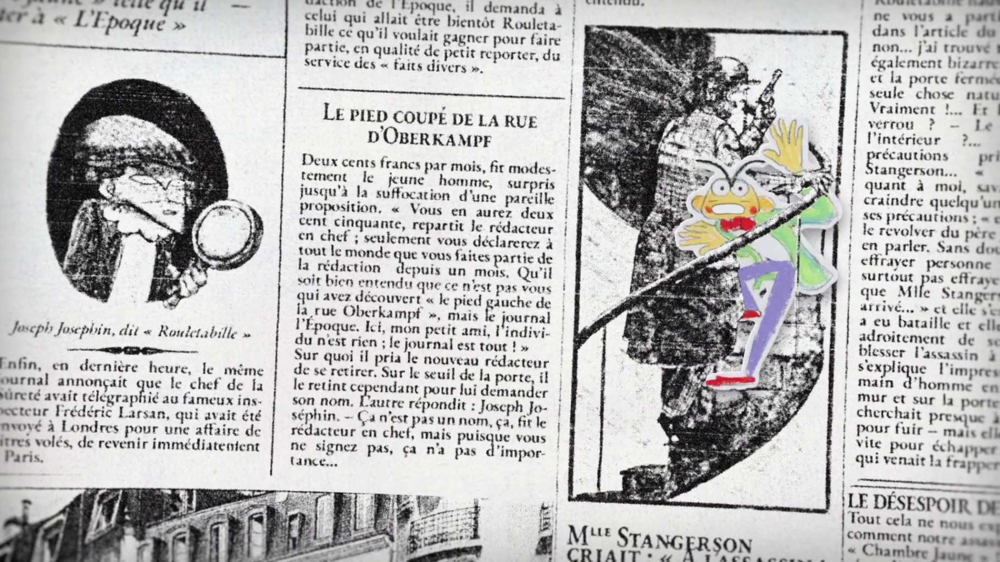

*2 min 15 / Collection Première Page / Scalaé Productions / France TV*

<a href="https://www.france.tv/france-4/premiere-page/6365981-le-mystere-de-la-chambre-jaune.html" class="button">▶ Regarder sur le site de France TV</a>

J'ai eu le plaisir de réaliser il y a quelques mois un court-métrage de 2 minutes pour la nouvelle collection **Première page** qui sera diffusée sur France Télévisions à partir du 12 août. Il s'agit d'une adaptation des premières lignes du *Mystère de la chambre jaune* de Gaston Leroux.

Un film rigolo à faire (et j'espère à regarder) où l'on suit le narrateur à travers une page de journal. Fabriqué avec TVpaint, beaucoup d'After Effects et quelques pastels Neocolor.

