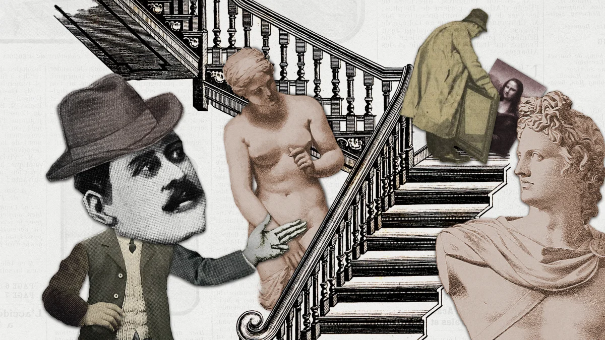
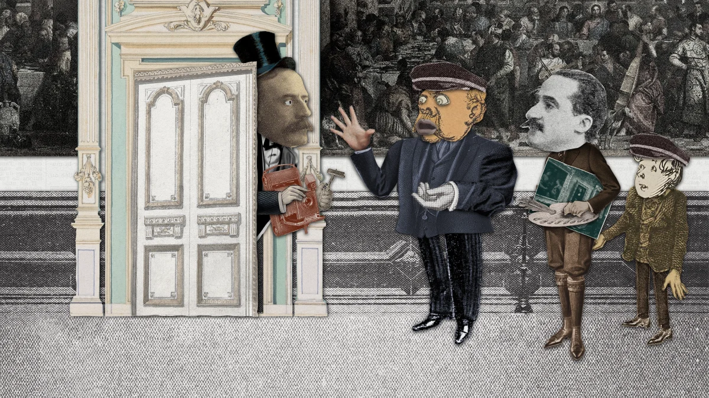
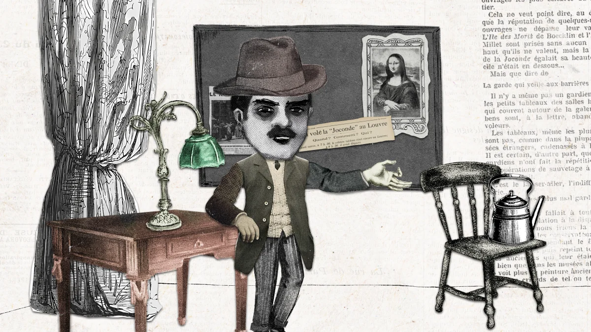

*Projet de série documentaire en cours d'écriture présenté lors du Cartoon Springboard 2024*

La **Gazette d’avant-hier** est une revue de presse qui a cent ans de retard. Chaque épisode mettra en images, de manière décalée et amusante, un véritable article de journal du début du siècle dernier, comme si l’auteur·ice de l’article revenait à la vie pour nous raconter un événement extraordinaire qui s'est produit à son époque à la manière d’un reportage télévisé.

Il sera aussi bien question de l’actualité du monde que de la vie quotidienne, du monde du travail, de faits divers rocambolesques, de surprenantes découvertes scientifiques, des nouveautés de la mode, etc., chaque épisode mettant ainsi en scène une facette différente de la société des années 1900-1939. Les points de vue exprimés seront aussi les plus variés possible, en allant chercher aussi bien dans la presse classique nationale que dans les journaux locaux ou plus engagés comme le quotidien féministe La Fronde ou la presse socialiste.

